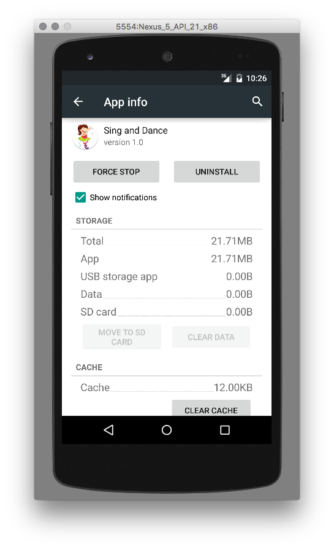
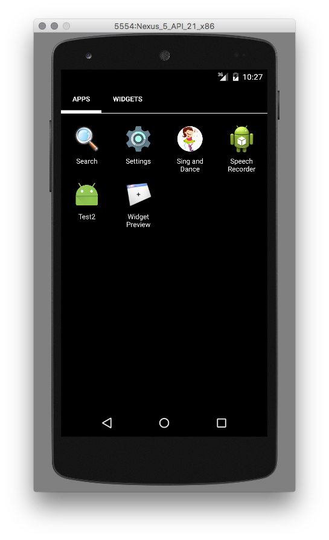
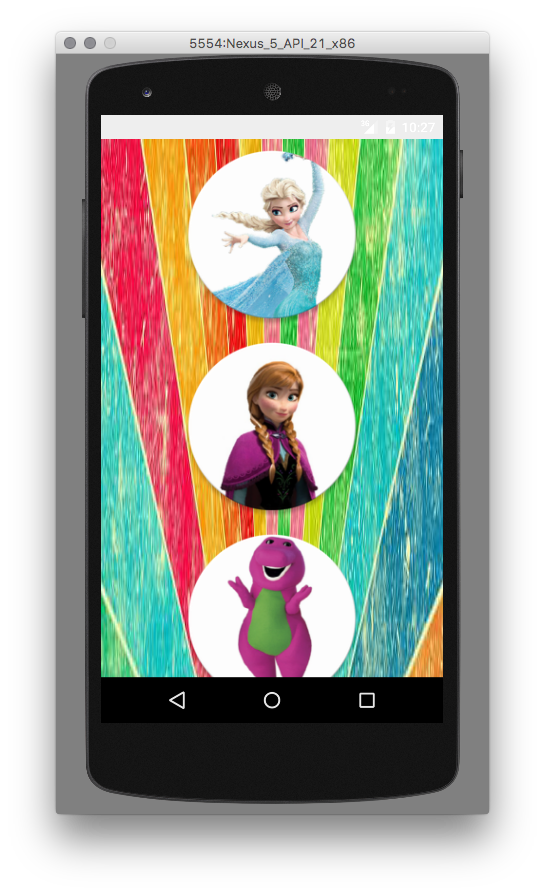
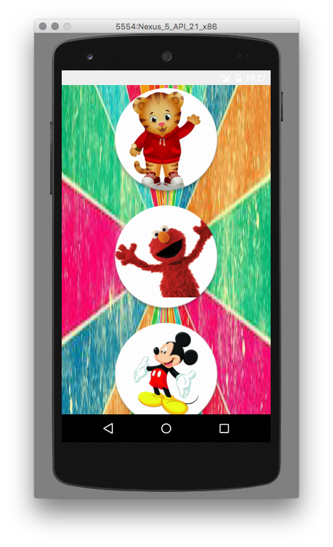
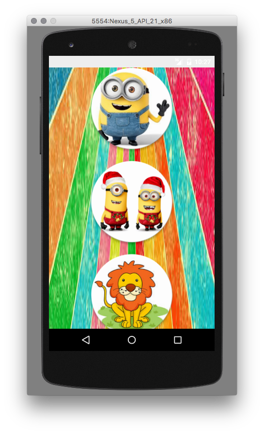
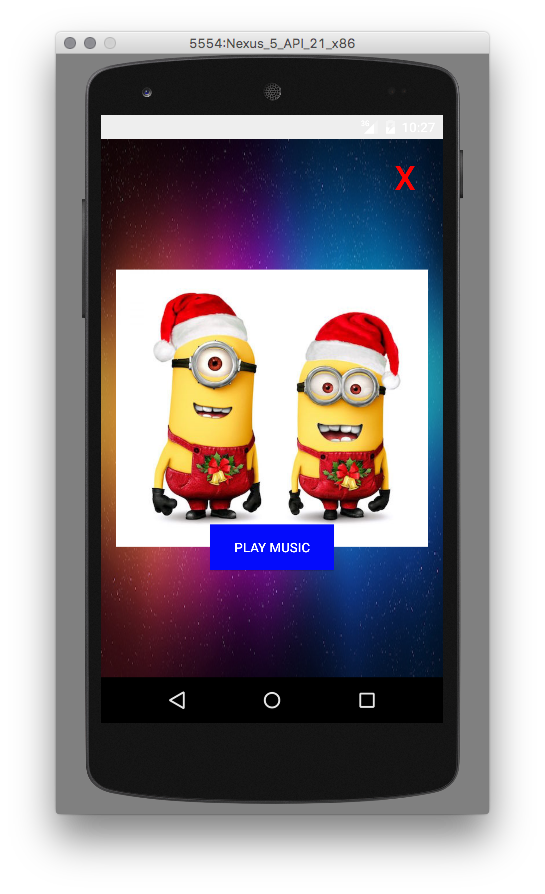

Sing and Dance
==============

Sing and dance is a simple mobile for kids up to 3 years. Basically
it show the character picture and the kid clicks to a button to
play the theme music for the character.

It is not available at Google Play store but you can clone this repo
install/deploy this app to your phone. So far I don't have
plan to make this available at Google play.

Motivation:
-----------

My daughter, 2.5y and the available toys for this age. real story: recently we were at
store and my daughter loved a microfone that plays Frozen theme song but it doesn't play the full song
only few seconds and makes my daughter upsaid, as she loves to sing and to dance I decided
to make her own playback with full Frozen theme song pluse some others songs from others
characters that she loves.

Issues:
-------

1. The "Play Music" button, replace the text to play symbol as it is universal
language and easy to be recognized for all kids.
2. The "Play Music" button, once clicked, change color and set disabled for 10 seconds
to avoid double click and stop the music and to have a visual effect improving the accessibility.

Images:
-------

How to build and install/deploy to your cell:
--------------------------------------------

First of all your cell must be runninf Android minimum API 21 so Android 5.0 Lollipop.
Clone this repo, load in your Android Studio as a project, check or edit the project
configuration if you want to test it in a emulator first then set the target to USB.
Make sure you enabled Debug mode in your Android phone:

To access these settings, open the Developer options in the system Settings.
On Android 4.2 and higher, the Developer options screen is hidden by default.
To make it visible, go to Settings > About phone and tap Build number seven times. Return to the
previous screen to find Developer options at the bottom

http://developer.android.com/tools/device.html